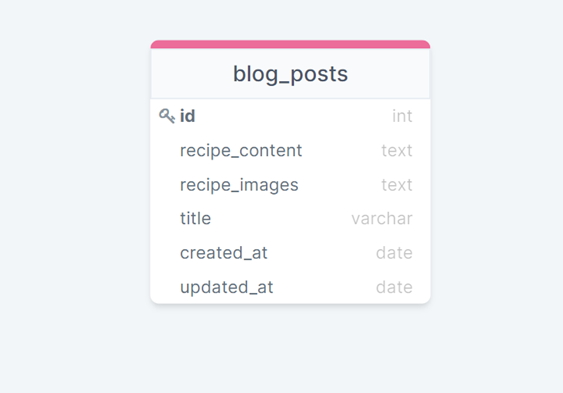
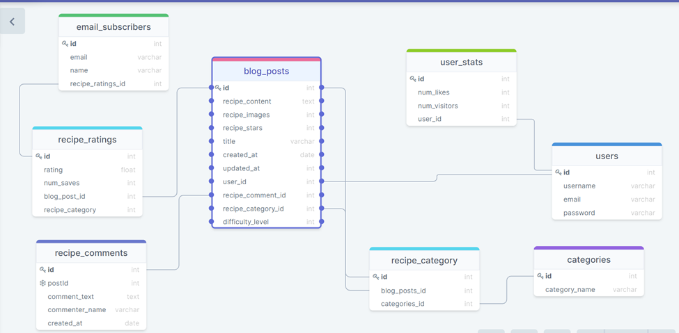
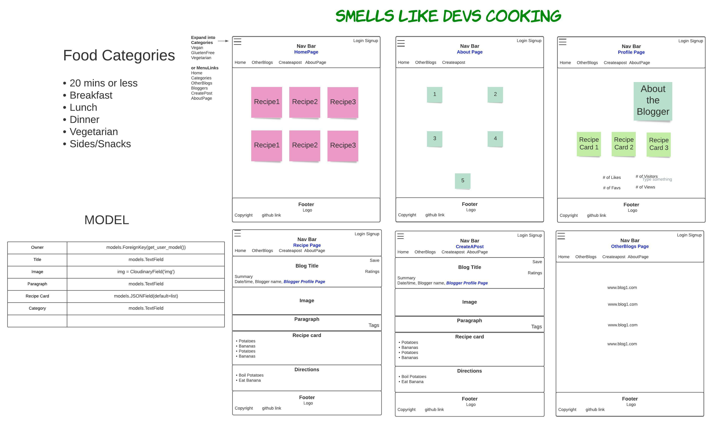
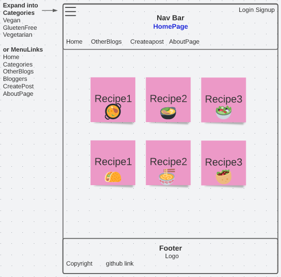
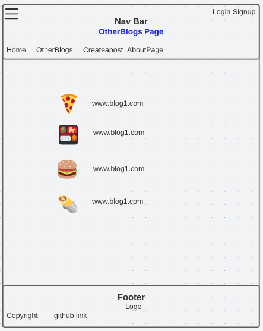
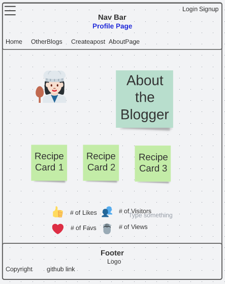

# Smells Like Devs Cooking

## Meet The Spice Devs

___
- Thomas Basham [GitHub](https://github.com/Thomas-Basham) [LinkedIn](https://www.linkedin.com/in/thomas-basham/)
- Dwight Lindquist [GitHub](https://github.com/dlindqu3) [LinkedIn](https://www.linkedin.com/in/dwight-lindquist-a9a0b6b4/)
- Ella Svete [GitHub](https://github.com/EllaSvete) [LinkedIn](https://www.linkedin.com/in/ellasvete/)
- Michele Salazar [GitHub](https://github.com/MISalz) [LinkedIn](https://www.linkedin.com/in/michellesalazar010/)
- Eden Brekke [GitHub](https://github.com/eden-brekke) [LinkedIn](https://www.linkedin.com/in/eden-brekke/)

## Project Description 

___
[Deployed Site](https://smells-like-devs-cooking-frontend-rho.vercel.app/)

Welcome to The Smells Like Devs Cooking Blog! Where we aim to share fun and creative recipes.

## Wireframes

MVP:  

Stretch Goal Model Schema:  

___
Full Front End Wireframe/Model:  

___

Zoomin:

Home Page:  

___
Individual Post:  

___
Profile Page:  

___
About The Devs:  

___
Additional User Potential Page:  

___

## Technologies Used

- Jira Project Management
- Next.JS
- TailwindCSS
- React
- Django
- ElephantSQL

## Acknowledgements

- JB Tellez
- David Hecker
- Justin Hammerly
- Adam Owada
- Aaron Imbrock
- Joseph Streifel
- Chloe Nott

### Outside Links

[Slides](https://docs.google.com/presentation/d/1WwcZhFPevnMV2WWOjw9IiGGKH4uPVIp1rnqhOzyoCNI/edit#slide=id.g2accd1c413_3_31)

[Wireframe](https://lucid.app/lucidspark/53f6b0e3-78ed-46f2-a3c3-6567944b94c2/edit?beaconFlowId=7F94EC044FB18AF5&invitationId=inv_9a1aff4e-c939-4b45-83bd-0f223c92a446#)

[Domain Modeling](https://lucid.app/lucidspark/e844d619-8a74-4f70-b5b7-02bf68fc4e14/edit?beaconFlowId=38525C1D8AD6D91C&invitationId=inv_2ac39359-abf7-43f9-bf88-442759cebe14#)

[Jira Project Management](https://the-spice-devs.atlassian.net/jira/software/projects/SD/boards/1)