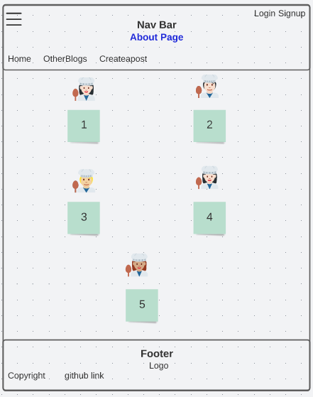

# Smells Like Devs Cooking

## Meet The Spice Devs

___
- Thomas Basham [GitHub](https://github.com/Thomas-Basham) [LinkedIn](https://www.linkedin.com/in/thomas-basham/)
- Dwight Lindquist [GitHub](https://github.com/dlindqu3) [LinkedIn](https://www.linkedin.com/in/dwight-lindquist-a9a0b6b4/)
- Ella Svete [GitHub](https://github.com/EllaSvete) [LinkedIn](https://www.linkedin.com/in/ellasvete/)
- Michele Salazar [GitHub](https://github.com/MISalz) [LinkedIn](https://www.linkedin.com/in/michellesalazar010/)
- Eden Brekke [GitHub](https://github.com/eden-brekke) [LinkedIn](https://www.linkedin.com/in/eden-brekke/)

## Project Description 

___
[Deployed Site]()

Welcome to The Smells Like Devs Cooking Blog! Where we aim to share fun and creative recipes.

## Wireframes

___
Home Page:

___
Individual Post:

___
Profile Page:

___
About The Devs:

___
Additional User Potential Page:

___

## Technologies Used

- Jira Project Management
- Next.JS
- TailwindCSS
- React
- Django
- ElephantSQL

## Acknowledgements

- JB Tellez
- David Hecker
- Justin Hammerly
- Adam Owada
- Aaron Imbrock
- Joseph Streifel
- Chloe Nott